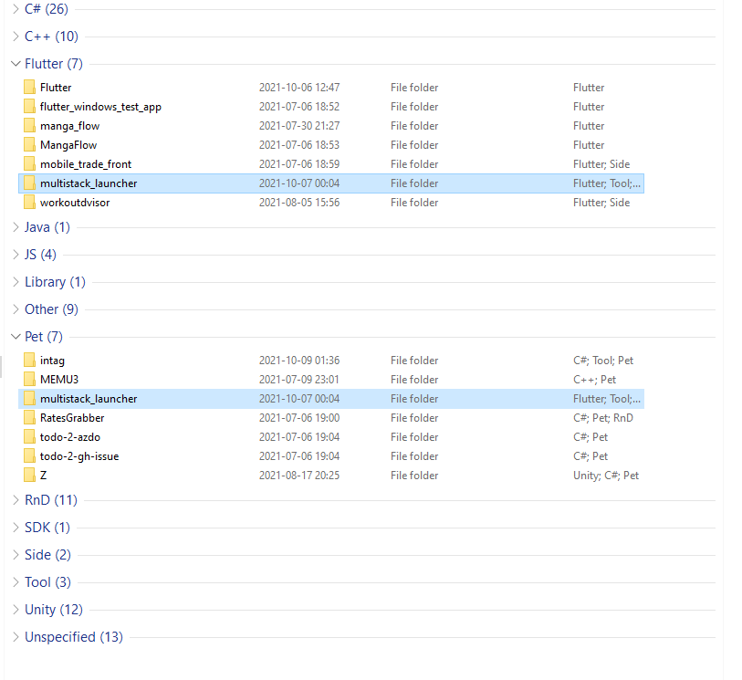
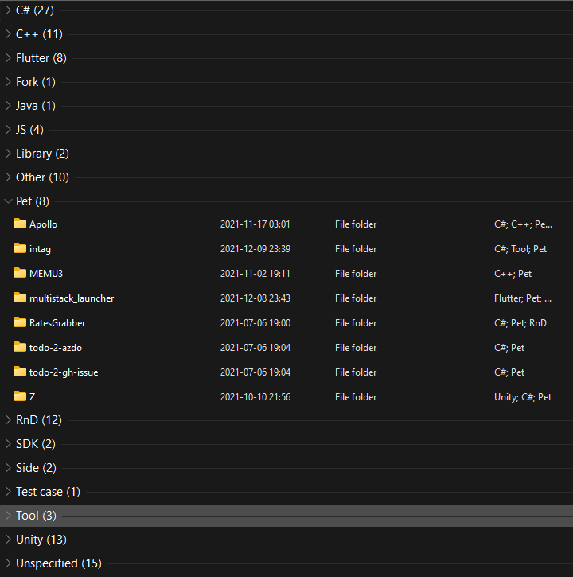
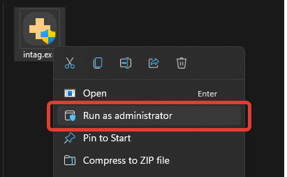

# InTag

> **To organize things even better** check out my other tool I've been developing. It's actually quite good :)
> 
> [Multistack Launcher GitHub project](https://github.com/Jamminroot/multistack_launcher)

> **SUGGESTIONS ARE WELCOME, SO ARE DONATIONS**, as they both boost my motivation to improve those tools:+1:

Add tags from explorer context menu. Can scan "neighbours" and use their tags. 

Aimed to be small and kind of lightweight.






## Usage

* After the tool is installed, right-click the folder (for Windows 11, you'd have to press 'Show more options'), select InTag.
* Assign tags you want to a folder (or a file, if it does support `System.Keywords` metadata). Neighboring tags are included to list of available for convenience.
* Once done, just click back to the folder or press esc, tags would be assigned. Note that it takes some time for explorer to detect those changes.
* If you haven't yet, make sure to enable grouping by tags (Context menu on the folder background > group by > More... > Select 'Tags' in a list, and use it a as a grouping criteria).

## Installation

### Automagical

Start application once. It *should* "install" itself on it's own after that, but if that doesn't work, though, refer to **Almost automagical** method (aka Run-as-admin) below.

### Almost automagical

> **Disclaimer** I want everyone to be able to use InTag, thus I simplified installation down to just run-as-admin-once :smile:

Open application's context menu (just right mouse button application icon on it in explorer), run application with administrator rights:



That's it, It should be installed now.

### Last resort (aka Manually)

Put .exe somewhere (for example, c:\tools\intag.exe).

Alternatively you can add registry entry (don't forget to fix your path):

> **NOTE**: This does not include icon. For icon refer to the code below

In `HKEY_CLASSES_ROOT\Folder\shell\InTag\command`, replace `Default` value with `"C:\\<PUT YOUR PATH HERE>\\intag.exe" "%1"` to support folders.

In `HKEY_CLASSES_ROOT\*\shell\InTag\command`, replace `Default` value with `"C:\\<PUT YOUR PATH HERE>\\intag.exe" "%1"` to support all files.

> **NOTE**: Notice double quotes, that is necessary for paths with spaces to work.


Or just run this regedit (also included as a reg, but again - don't forget to fix path):

```reg
Windows Registry Editor Version 5.00

[HKEY_CLASSES_ROOT\Folder\shell\InTag]
"Icon"="\"C:\\<PUT YOUR PATH HERE>\\intag.exe\""

[HKEY_CLASSES_ROOT\Folder\shell\InTag\command]
@="\"C:\\<PUT YOUR PATH HERE>\\intag.exe\" \"%1\""

[HKEY_CLASSES_ROOT\*\shell\InTag]
"Icon"="\"C:\\<PUT YOUR PATH HERE>\\intag.exe\""

[HKEY_CLASSES_ROOT\*\shell\InTag\command]
@="\"C:\\<PUT YOUR PATH HERE>\\intag.exe\" \"%1\""
```

## Uninstall

### Via argument

Run exe with `--uninstall` or `-u` argument

### Manually

Remove `HKEY_CLASSES_ROOT\Folder\shell\InTag` and `HKEY_CLASSES_ROOT\*\shell\InTag` entries

### Third-Party Notice

Code for individual files management was taken from Windows API Code Pack