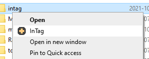
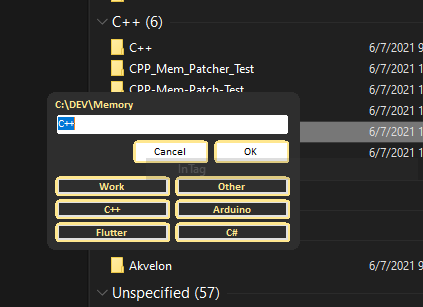

# InTag

Add tags from explorer context menu. Can scan "neighbours" and use their tags. 

Aimed to be small and kind of lightweight (yet I believe code is fairly bad :D)





## Installation

Put .exe somewhere, make sure it's executable - I did try to fix those permissions, but did not bother too much tbh (only spent like 2 hrs on this including "investigation").

Add registry entry (don't forget to fix your path):

in `HKEY_CLASSES_ROOT\Folder\shell\InTag\command`, replace Default in with `C:\\<PUT YOUR PATH HERE>\\intag.exe %1`

Or just run this regedit (also included as a reg, but again - don't forget to fix path):

```reg
Windows Registry Editor Version 5.00

[HKEY_CLASSES_ROOT\Folder\shell\InTag\command]
@="C:\\<PUT YOUR PATH HERE>\\intag.exe %1"
```