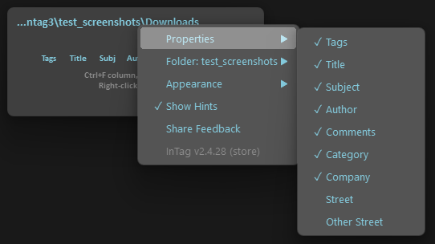

# InTag

InTag is a lightweight tool for tagging files and folders directly from the Windows Explorer context menu. Nearby tags are suggested automatically for quick reuse.

## Features

- Tag files and folders from the Explorer context menu
- Multiple metadata properties: Tags, Title, Subject, Author, Comments, Category, Company, Street, and more
- Suggested tags from nearby files for quick reuse
- Toggle column visibility and grouping per folder with Ctrl+F / Ctrl+D
- CLI support for scripting and automation
- Works on Windows 10 and 11

## Usage (UI)

1. Right-click a folder or file and select InTag.


2. Assign tags or edit metadata properties. Nearby tags appear as suggestions.


3. Press Enter or click away to apply. Press Esc to cancel.


4. Right-click the InTag window to access settings: toggle properties, change appearance, and more.



5. Use Ctrl+F to toggle column visibility or Ctrl+D to toggle grouping for the current property in the parent folder.


## Usage (CLI)

```ps1
# Add tags:
.\intag.exe --add "test_tag" --path "C:\path\to\folder\or\file"
# Remove tags:
.\intag.exe --remove "test_tag" --list "C:\path\to\list\file"
# Add And Remove tags (will combine files in list file and argument of "--path")::
.\intag.exe  --add "test_tag" --remove "test_tag" --list "C:\path\to\list\file" --path "C:\path\to\folder\or\file"
```

## Installation

### Microsoft Store (recommended)
Install directly from the [Microsoft Store](https://apps.microsoft.com/detail/9N4TXKFKSF8K). Updates are handled automatically.

### Standalone
Download the latest release and run `intag.exe`. It will register itself automatically on first launch.

## Uninstall

- **Store version**: Uninstall from Windows Settings > Apps, or right-click the app in the Start menu.
- **Standalone version**: Launch `intag.exe` directly (not from the context menu) and select the Uninstall option, or run with `--uninstall`.

## Contributions to the legacy version (still grateful)

[montoner0](https://github.com/montoner0) - great PR with bunch of improvements and fixes, also nice suggestions

## Third-Party Notice

The code for individual file management was taken from the Windows API Code Pack.

## Additional Tool

For even better organization, check out Multistack Launcher,
