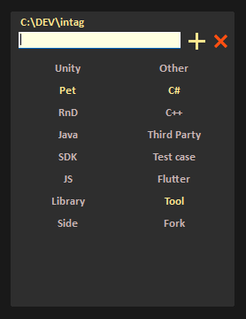

# InTag

> **To organize things even better** check out my other tool I've been developing. It's actually quite good :)
> 
> [Multistack Launcher GitHub project](https://github.com/Jamminroot/multistack_launcher)

> **SUGGESTIONS ARE WELCOME, SO ARE DONATIONS**, as they both boost my motivattion to improve those tools:+1:

Add tags from explorer context menu. Can scan "neighbours" and use their tags. 

Aimed to be small and kind of lightweight (yet I believe code is fairly bad :D)





## Usage

* After the tool is installed, right-click the folder (for Windows 11, you'd have to press 'Show more options'), select InTag.
* Assign tags you want to a folder. Neighboring tags are included to list of available for convenience.
* Once done, just click back to the folder or press esc, tags would be assigned. Note that it takes some time for explorer to detect those changes.
* If you haven't yet, make sure to enable grouping by tags (Context menu on the folder background > group by > More... > Select 'Tags' in a list, and use it a as a grouping criteria).

## Installation

### Via argument

Run exe with `--install` or `-i` arguement

### Manually

Put .exe somewhere, make sure it's executable - I did try to fix those permissions, but did not bother too much tbh (only spent like 2 hrs on this including "investigation").
Alternativelyyou add registry entry (don't forget to fix your path):

> **NOTE**: This does not include icon. For icon refer to the code below

in `HKEY_CLASSES_ROOT\Folder\shell\InTag\command`, replace Default in with `"C:\\<PUT YOUR PATH HERE>\\intag.exe" "%1"`

> **NOTE**: Notice double quotes, that is necessary for paths with spaces to work.


Or just run this regedit (also included as a reg, but again - don't forget to fix path):

```reg
Windows Registry Editor Version 5.00

[HKEY_CLASSES_ROOT\Folder\shell\InTag]
"Icon"="\"C:\\<PUT YOUR PATH HERE>\\intag.exe\""

[HKEY_CLASSES_ROOT\Folder\shell\InTag\command]
@="\"C:\\<PUT YOUR PATH HERE>\\intag.exe\" \"%1\""
```

## Uninstall

### Via argument

Run exe with `--uninstall` or `-u` argument

### Manually

Remove `HKEY_CLASSES_ROOT\Folder\shell\InTag` entry
